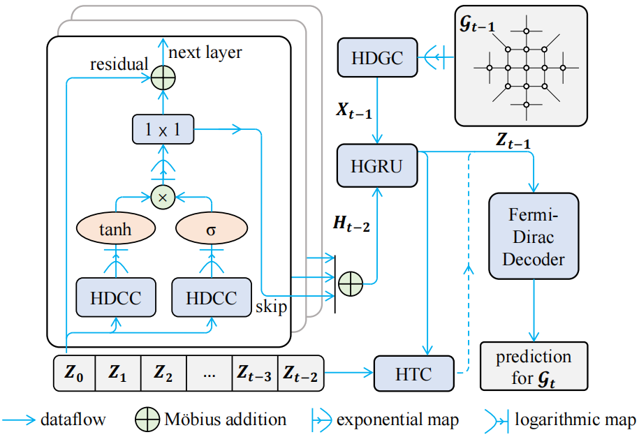

## 1. Overview

PyTorch Implementation for "[HGWaveNet: A Hyperbolic Graph Neural Network for Temporal Link Prediction (WWW2023)](https://dl.acm.org/doi/abs/10.1145/3543507.3583455)“

Authors: Qijie Bai, Changli Nie, Haiwei Zhang, Dongming Zhao, Xiaojie Yuan



## 2. Examples

Run `python main.py --dataset=dblp` for example.

**Some critical config parameters:** 

- `--dataset`, `--data_pt_path`: name and parent path of dataset
- `--test_length`: number of snapshots for test set
- `--spatial_dilated_factors`: a list, dilated factor for HDGC module
- `--casual_conv_depth`, `--casual_conv_kernel_size`: number of temporal casual convolution layers, temporal casual convolution kernel size, used to config the receival field of HDCC module

For all config parameter description, please refer to `./cofig.py`

## 3. Data preprocessing

The demo dataset can be found in `./data/`

The input data is a serialized `dict` object by `torch.save()`. It has the following keys:

- `edge_index_list`: a list of torch tensors, each of which is the edge index of single snapshot
- `pedges`, `nedges`: a list of torch tensors, each of which is the sampled positive and negative edge index of single snapshot for temporal link prediction
- `new_pedges`, `new_nedges`: a list of torch tensors, each of which is the sampled positive and negative edge index of single snapshot for temporal new link prediction
- `num_nodes`: number of nodes of the whole temporal graph
- `time_length`: number of snapshots, numerically equal to the length of `edge_index_list`, `pedges`, `nedges`, `new_pedges` and `new_nedges`
- `weights`: input node feature tensor, remain `None` if there is no input feature

## 4. Citation

If you find this code useful, please cite the following paper:

```latex
@inproceedings{bai2023hgwavenet,
  title={HGWaveNet: A Hyperbolic Graph Neural Network for Temporal Link Prediction},
  author={Bai, Qijie and Nie, Changli and Zhang, Haiwei and Zhao, Dongming and Yuan, Xiaojie},
  booktitle={Proceedings of the ACM Web Conference 2023},
  pages={523--532},
  year={2023}
}
```

**Note: ** there is a typo in our code that we misspelled *causal* instead of *casual*, but it does not affect the code running results.
